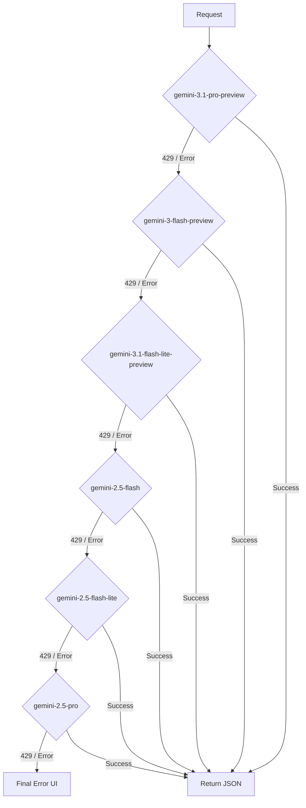

# 🧠 GK Stock Insights — Business & Technical Logic Documentation

This document provides a detailed breakdown of the internal logic, scoring algorithms, and technical architecture powering the Indian Stock Fundamental Analyser.

---

## 💎 1. Business Logic: Scoring & Ranking

The core value of the app is the **Composite Scoring Engine**, which translates raw market data and AI insights into a single 0–100 score.

### 📊 1.1 Equity Scoring Logic (Penny & Nifty 100)
Used in the "Penny Stocks" and "NIFTY 100" tabs to rank undervalued opportunities.

**Expert Override Layer:**
To eliminate AI hallucinations, the final recommendation is programmatically recalculated in the frontend:
1. **Derived Upside:** Calculated as `(Analyst Target - CMP) / CMP`.
2. **Valuation Safety Cap:** If `CMP > Analyst Target`, the total score is strictly capped to prevent false-positive "BUY" signals on overvalued stocks.
3. **Live Sync:** Both the screener and single-stock reports perform this recalculation on-the-fly using the latest live market data.

| Factor | Weight | Logic / Formula |
| :--- | :--- | :--- |
| **Price Momentum** | 25% | % change over last 5 trading days. Higher positive momentum scores higher. |
| **Volume Surge** | 20% | Compares current volume to 3-month average. Ratio > 3.0× gets max score. |
| **52W High Proximity** | 15% | Distance from 52-week high. Stocks trading near highs are favoured for strength. |
| **Value (P/E)** | 15% | Compares current P/E to sector median. Stocks below sector average score higher. |
| **RSI Sweet Spot** | 15% | Wilder RSI(14). Optimal range 40–65. Avoids overbought (>70) or oversold (<30). |
| **Stability (MCap)** | 10% | Logarithmic scale based on Market Cap. Favours established stability over micro-caps. |

### 📈 1.2 F&O Scoring Logic
Used in the "F&O Trading" tab to identify high-probability derivative plays.
**Strategy Filtering:** Traders can filter picks using a budget dropdown (₹50k–₹5L) which cross-references the AI-calculated **Max Risk** for each strategy.

| Factor | Weight | Logic / Formula |
| :--- | :--- | :--- |
| **OI Size** | 20% | Large Open Interest indicates deep liquidity and institutional participation. |
| **OI Change %** | 20% | Positive change in OI (Buildup) + Price increase = Strong Bullish Signal. |
| **Price Trend** | 20% | Directional confidence over 5 days. |
| **IV Sweet Spot** | 15% | Implied Volatility between 20%–50% is ideal for directional option buying. |
| **Volume Ratio** | 15% | Ratio of current contract volume vs. average. |
| **Put-Call Ratio** | 10% | Balanced sentiment (0.7–1.3). Extremes suggest reversal risk. |

### 📊 1.3 Crypto Discovery Logic
Used in the "Crypto Picks" tab to identify high-potential assets under ₹200.

| Factor | Weight | Logic / Formula |
| :--- | :--- | :--- |
| **Multibagger Calc** | 30% | AI-simulated forward multiple vs All-Time High (ATH) recovery potential. |
| **Utility Score** | 25% | Evaluation of real-world adoption, ecosystem growth, and protocol security. |
| **India Suitability** | 20% | Availability on WazirX/CoinDCX + Indian tax impact reconciliation. |
| **Risk Factors** | 15% | Regulatory risk, liquidity depth, and volatility profiling. |
| **Price Discipline** | 10% | Enforces ₹200 cap to identify accessible opportunities for retail investors. |

### 🎯 1.4 RA Stock Pick Logic (New)
Used in the "RA Stock Pick" tab. Unlike the screener which ranks a pre-made list, this pipeline applies a full SEBI RA-style 7-step analysis to identify and rank 7–10 high-conviction ideas.

**Hard Pre-Filters (server-side):**
- CMP ≤ ₹500 (enforced post-parse — picks above ₹500 are stripped)
- Market cap > ₹50 Cr
- Average daily volume > ₹20 lakh
- Minimum 1 year listing history
- No ASM/GSM categorisation
- No SEBI enforcement or promoter fraud alerts

**Fundamental Quality Score (/10):**
| Criterion | Points |
|-----------|--------|
| P/E ≥ 30% below sector median | 2.5 |
| Revenue growth ≥ 15% YoY (Q1) | 2.5 |
| Revenue growth ≥ 15% YoY (Q2) | 2.5 |
| D/E < 1.0 | 1.0 |
| Promoter holding > 40%, stable/increasing | 1.5 |

**Technical Rating:** STRONG / MODERATE / WEAK — only STRONG or MODERATE advance to output.

**Ranking:** AI ranks all passing stocks by overall conviction (risk-reward). Rank #1 = strongest asymmetric setup.

**Diversification Rule:** Picks span ≥ 5 different sectors.

### 🏷️ 1.5 Recommendation Tiers
The final composite score is mapped to actionable badges. Recommendations are strictly enforced by the **Valuation Safety Cap** logic.
- **80–100:** ⭐ **STRONG BUY** (High momentum + Undervalued)
- **60–79:** ✅ **BUY** (Positive trend + Reasonable valuation)
- **40–59:** ⚠️ **HOLD** (Sideways movement, fair valuation, or hit Analyst Target)
- **20–39:** 🔻 **AVOID** (Negative trend or overvaluation)
- **0–19:** ❌ **SELL** (Crashing volume + Extreme sell-off)

---

## 🧠 2. Business Logic: AI Strategy

### 🤖 2.1 The "Master Router" Prompting
AI calls are designed to be "Strategy-First." Instead of just fetching data, the AI acts as a filter.

**Instruction Pattern:**
- "Analyse like a SEBI-registered professional."
- "Provide a 3-leg strategy: Entry, Target, and Stop-Loss."
- "Identify exactly 3 risks per stock."
- "Classify the technical trend as UPTREND, DOWNTREND, or SIDEWAYS."

### 🎯 2.2 RA Stock Pick Prompting Strategy
The RA tab uses a more structured 7-step directive prompt:

```
STEP 1 — INTELLIGENCE: Synthesise latest news, filings, social sentiment,
         promoter activity, broker reports for each candidate.
STEP 2 — FILTER: CMP ≤ ₹500, Mkt Cap > ₹50 Cr, Volume > ₹20L/day,
         1yr+ listing, no ASM/GSM.
STEP 3 — TECHNICAL: RSI ≤35 (oversold), bullish MACD crossover,
         volume surge ≥3×, strong support. Rate STRONG/MODERATE only.
STEP 4 — FUNDAMENTALS: P/E ≥30% below sector median, Revenue growth
         ≥15% YoY (2 qtrs), D/E <1.0, Promoter >40% stable. Score /10.
STEP 5 — CATALYST: Each stock must have a clear PRIMARY catalyst.
STEP 6 — HORIZON: Separate ST and LT target prices per pick.
STEP 7 — RANK & OUTPUT: Rank all picks by overall risk-reward conviction.
```

Key prompt constraints:
- `technicalNotes` and `fundamentalNotes` limited to 1–2 sentences to stay within token limits
- `catalysts` limited to 2 items per pick
- `latestNews` limited to 2 items per pick
- Each pick returns a consistent JSON schema validated at the server layer

### 🔄 2.3 AI Self-Learning Pipeline (v2.0 — Supabase)
The platform implements a sophisticated Reinforcement Learning-style feedback loop:
1. **Continuous Tracking**: Every AI recommendation is logged to the `recommendations` table with a "PENDING" status.
2. **Outcome Checkpoints**: An automated process verifies stock prices at 7, 14, and 30-day intervals.
3. **Performance Feedback**: Recommendations are marked as **WIN**, **LOSS**, or **PARTIAL** based on target/stop-loss hits.
4. **Learning Injection**: Before every new analysis, the system fetches the last 20 outcomes and injects them into the AI's prompt as "Self-Learning Feedback."
5. **Adaptive Strategy**: The AI analyzes its past failures and adjusts its selection criteria in real-time.
6. **Learning Takeaways**: AI-generated insights into *why* it changed its strategy are stored in the `ai_learning_log` for user transparency.

---

## 🛠️ 3. Technical Logic: Performance & Reliability

### 🚀 3.1 Parallel Execution (`Promise.allSettled`)
To achieve sub-3-second load times for all pick lists:
- **WRONG:** Sequential loops waiting for each stock's Yahoo Finance data.
- **RIGHT:** Batch processing. All tickers fired simultaneously. `allSettled` ensures one failed ticker doesn't crash the entire dashboard.
- **RA Tab:** After AI returns 7–10 picks, all tickers are fetched for live prices simultaneously in a single `useLiveQuotes` call.

### 🛡️ 3.2 AI Fallback Cascade (The "Bulletproof" Chain)
Since LLM APIs can be flaky or hit rate limits (429), we implemented a multi-level fallback in `ai-provider.ts`:


- **5-second sleep** between retries to allow rate-limit windows to reset.
- **Quota Separation:** Each model uses a different quota bucket, increasing the chance of success.
- **Hardened JSON Recovery:** `parseAIJson` automatically strips markdown fences, repairs trailing commas, and extracts the raw JSON block to prevent "Unreadable Data" errors.
- **Safety Bypass:** All AI requests use `BLOCK_NONE` safety settings to ensure comprehensive financial analysis without model-level censorship.

### 💾 3.3 Multi-Layer Caching (`gkCache`)
Implemented in `perf-utils.ts` to reduce API costs and latency:
- **Memory Cache:** Instant access for current session.
- **LocalStorage Cache:** Persists across tabs/refreshes.
- **Dynamic TTL:**
    - **Market Hours:** 60 seconds (live prices must be fresh).
    - **After Hours:** 6 hours (prices don't change).
    - **AI Screener:** 5 minutes (strategic views are slower to change).
    - **RA Stock Pick:** Not cached — always runs fresh (AI analysis + live prices fetched on demand).

### 📡 3.4 Market-Hours Awareness
The `useMarketStatus` hook prevents unnecessary API calls:
- **Polls every 60s** only during 09:15–15:30 IST, Monday–Friday.
- **Auto-Pauses** if the browser tab is hidden (using `visibilitychange` API) to save user data/battery.

### 🛡️ 3.5 UI Hardening & Defensive Rendering
Implemented to handle inconsistent AI responses and edge-case market data:
- **`s()` Helper:** A `String()` coercion utility (`s(val, fallback)`) applied to all AI-derived fields before any string operation — prevents `Cannot read properties of undefined (reading 'replace')` crashes.
- **Safe Array Guards:** All AI-returned arrays (`whyThisStock`, `catalysts`, `risks`, `latestNews`, `filtersPass`, `redFlagsChecked`) are validated with `Array.isArray()` before `.map()` calls.
- **Numeric CMP Normalisation:** If the AI returns a CMP as a plain number (e.g., `480`) instead of a `₹`-prefixed string, the server function coerces it to `₹480` and validates it against the ≤₹500 filter.
- **Optional Chaining:** Ubiquitous use of `?.` for all AI-derived properties.
- **Fallback Formatter:** Numeric metrics use `(val ?? 0).toLocaleString()` to prevent crashes on partial data.
- **52W Context:** Every asset type (Stock, F&O, Crypto, RA Pick) renders 52-week High/Low extremes for price context.
- **Explicit F&O Actions:** F&O strikes are explicitly prefixed with "BUY" or "SELL" to eliminate tactical ambiguity.

### 🔴 3.6 Live Price Integration for RA Picks
After the AI analysis resolves, the dashboard derives a clean ticker list from all picks and passes it to `useLiveQuotes`:

```typescript
// Strips NSE:/BSE: prefix and .NS/.BO suffix
const liveSymbols = result.picks.map(p => toYahooSymbol(p.ticker));
const { quotes } = useLiveQuotes(liveSymbols);

// Each PickCard receives its quote state
<PickCard quoteState={quotes[toYahooSymbol(pick.ticker)]} ... />
```

The `LivePriceBlock` component then renders the real price with ▲/▼ change instead of the stale AI training-data estimate. Three states: loading (spinner) → ok (real price + badge) → error (AI estimate fallback).

---

## 📊 4. Technical Logic: My Portfolio

### 🔒 4.1 Zero-Backend Persistence
The Portfolio tab uses `localStorage` as the primary database.
- **`gk_portfolio_entries`:** Stores user-added stocks (ID, Symbol, Qty, Price).
- **`gk_portfolio_ai_cache`:** Stores the latest AI recommendations per symbol.

### 📥 4.2 Excel Data Ingestion
A high-performance bridge between local spreadsheets and the web dashboard.
1. **Dynamic Templating**: The app generates a `.xlsx` file pre-filled with the user's current holdings using `XLSX.writeFile`.
2. **Serial Date Normalisation**: Implements a robust converter for Excel's 1900-date-system (serial numbers) to standard JS ISO dates.
3. **Fuzzy Header Mapping**: Recognises diverse CSV/Excel headers like "Qty", "Quantity", and "Number of Shares" to minimise import errors.
4. **Smart Deduplication**: Cross-references incoming symbols against existing `localStorage` entries before commit.

### ⚡ 4.3 Batch AI Recommendations
Unlike the screener which gets a pre-made list, the Portfolio AI must handle **custom user lists**:
1. Collects all unique symbols from the user's portfolio.
2. Sends a single batch prompt to Gemini: "Analyze these N stocks and return a JSON array."
3. Maps results back to the UI table using the Symbol as the key.

---

## 📑 5. Technical Logic: PDF Export
Uses `jsPDF` and `jspdf-autotable`.
- **Logic:** Transcodes the current React state (table rows) into a PDF document.
- **Adaptive Layout:**
    - **Table Mode:** Landscape orientation to fit all metrics.
    - **Card Mode:** Portrait orientation with multi-line text wrapping for AI "Reasoning" and "Risks."

---

## ⚠️ 6. Error Handling Classification
The app categorises errors to provide better UX:
- **Rate Limit (429):** Shows a "Wait 60s" message with retry button.
- **Quota (402):** Prompts for a different API key.
- **Market Closed:** Shows a status badge and uses cached prices.
- **Network (5xx):** Triggers the fallback retry mechanism.
- **Parse Error:** `parseAIJson` applies multi-stage recovery (fence stripping → trailing-comma fix → bracket balancing) before surfacing an error.
- **Invalid Ticker (RA):** Post-parse CMP guard on server removes any pick exceeding ₹500 rather than failing the entire request.

---

## 📅 Changelog

### v3.0 — May 2026
- **🎯 NEW: RA Stock Pick tab** — 7-step SEBI RA-style AI screening for 7–10 undervalued stocks ≤ ₹500 CMP
  - Full 7-step pipeline: Intelligence → Filter → Technical → Fundamental → Catalyst → Horizon → Rank
  - Expandable per-pick cards with rank badges (🥇🥈🥉), conviction badges, technical/fundamental breakdown
  - Animated 7-step progress tracker during analysis
  - Red flag screening shield per pick
  - SEBI disclaimer + data notice inline
- **📡 Live NSE prices for RA Picks** — Yahoo Finance prices fetched immediately after AI analysis for all picks simultaneously; replaces stale AI training-data CMP
- **🛡️ Defensive rendering fixes** — `s()` coercion helper, `Array.isArray()` guards, numeric CMP normalisation; eliminates `Cannot read properties of undefined (reading 'replace')` crash class
- Diversification rule enforced: picks span ≥ 5 sectors per run

### v2.x — April–May 2026
- Crypto Picks tab with India Tax Calculator and Investor Suitability Check
- Mutual Funds dashboard (15 funds, 3 per category, dual AI/Expert analysis)
- My Portfolio tracker with Excel import/export and batch AI recommendations
- AI Performance Dashboard with win-rate tracking and calibration chart
- F&O explicit BUY/SELL strike labels, 52W high/low across all dashboards
- Robust `parseAIJson` with multi-stage JSON recovery
- 6-model Gemini cascade (added gemini-3.1 family)
- NSE ticker validation gate on Single Stock Analyser
