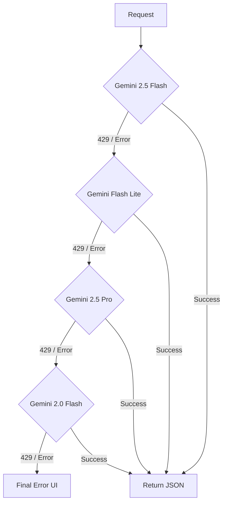

# 🧠 GK Stock Insights — Business & Technical Logic Documentation

This document provides a detailed breakdown of the internal logic, scoring algorithms, and technical architecture powering the Indian Stock Fundamental Analyser.

---

## 💎 1. Business Logic: Scoring & Ranking

The core value of the app is the **Composite Scoring Engine**, which translates raw market data and AI insights into a single 0–100 score.

### 📊 1.1 Equity Scoring Logic (Penny & Nifty 100)
Used in the "Penny Stocks" and "NIFTY 100" tabs to rank undervalued opportunities.

| Factor | Weight | Logic / Formula |
| :--- | :--- | :--- |
| **Price Momentum** | 25% | Calculated as the % change over the last 5 trading days. Higher positive momentum scores higher. |
| **Volume Surge** | 20% | Compares current volume to the 3-month average. Ratio > 3.0x gets a max score. |
| **52W High Proximity** | 15% | Percentage distance from the 52-week high. Stocks trading near highs are favored for strength. |
| **Value (P/E)** | 15% | Compares current P/E to the Sector Median P/E. Stocks below sector average score higher. |
| **RSI Sweet Spot** | 15% | Uses Wilder's RSI(14). Optimal range is 40–65. Avoids "overbought" (>70) or "dead" (<30). |
| **Stability (MCap)** | 10% | Logarithmic scale based on Market Cap. Favors established stability over micro-caps. |

### 📈 1.2 F&O Scoring Logic
Used in the "F&O Trading" tab to identify high-probability derivative plays.

| Factor | Weight | Logic / Formula |
| :--- | :--- | :--- |
| **OI Size** | 20% | Large Open Interest indicates deep liquidity and institutional participation. |
| **OI Change %** | 20% | Positive change in OI (Buildup) + Price increase = Strong Bullish Signal. |
| **Price Trend** | 20% | Directional confidence over 5 days. |
| **IV Sweet Spot** | 15% | Implied Volatility between 20%–50% is ideal for directional option buying. |
| **Volume Ratio** | 15% | Ratio of current contract volume vs. average. |
| **Put-Call Ratio** | 10% | Balanced sentiment (0.7 to 1.3). Extremes suggest reversal risk. |

### 🏷️ 1.3 Recommendation Tiers
The final composite score is mapped to actionable badges:
- **80 – 100:** ⭐ **STRONG BUY** (High momentum + Undervalued)
- **60 – 79:** ✅ **BUY** (Positive trend + Reasonable valuation)
- **40 – 59:** ⚠️ **HOLD** (Sideways movement or fair valuation)
- **20 – 39:** 🔻 **AVOID** (Negative trend or extreme overvaluation)
- **0 – 19:** ❌ **SELL** (Crashing volume + Extreme sell-off)

---

## 🧠 2. Business Logic: AI Strategy

### 🤖 2.1 The "Master Router" Prompting
AI calls are designed to be "Strategy-First." Instead of just fetching data, the AI acts as a filter.

**Instruction Pattern:**
- "Analyze like a SEBI-registered professional."
- "Provide a 3-leg strategy: Entry, Target, and Stop-Loss."
- "Identify exactly 3 risks per stock."
- "Classify the technical trend as UPTREND, DOWNTREND, or SIDEWAYS."

### 🔄 2.2 Self-Improving Intelligence Layer
The **AI Performance Dashboard** implements a feedback loop:
1. **Prediction:** AI makes a call (e.g., BUY at ₹500, Target ₹550).
2. **Persistence:** The call is saved in `localStorage` with a timestamp and "Confidence Score."
3. **Verification:** On subsequent visits, the app compares the prediction against current live prices.
4. **Accuracy:** Accuracy is calculated as: `(Current Price - Entry) / (Target - Entry)`.

---

## 🛠️ 3. Technical Logic: Performance & Reliability

### 🚀 3.1 Parallel Execution (`Promise.allSettled`)
To achieve sub-3-second load times for 20 stocks:
- **WRONG:** Sequential loops waiting for each stock's Yahoo Finance data.
- **RIGHT:** Batch processing. All 20 tickers are fired simultaneously. We use `allSettled` to ensure one failed ticker doesn't crash the entire dashboard.

### 🛡️ 3.2 AI Fallback Cascade (The "Bulletproof" Chain)
Since LLM APIs can be flaky or hit rate limits (429), we implemented a multi-level fallback in `ai-provider.ts`:

- **5-second sleep** between retries to allow rate-limit windows to reset.
- **Quota Separation:** Each model uses a different quota bucket, increasing the chance of success.

### 💾 3.3 Multi-Layer Caching (`gkCache`)
Implemented in `perf-utils.ts` to reduce API costs and latency:
- **Memory Cache:** Instant access for current session.
- **LocalStorage Cache:** Persists across tabs/refreshes.
- **Dynamic TTL:**
    - **Market Hours:** 60 seconds (Live prices must be fresh).
    - **After Hours:** 6 hours (Prices don't change).
    - **AI Screener:** 5 minutes (Strategic views are slower to change).

### 📡 3.4 Market-Hours Awareness
The `useMarketStatus` hook prevents unnecessary API calls:
- **Polls every 60s** only during 09:15 – 15:30 IST, Monday – Friday.
- **Auto-Pauses** if the browser tab is hidden (using `visibilitychange` API) to save user data/battery.

---

## 📊 4. Technical Logic: My Portfolio

### 🔒 4.1 Zero-Backend Persistence
The Portfolio tab uses `localStorage` as the primary database.
- **`gk_portfolio_entries`:** Stores user-added stocks (ID, Symbol, Qty, Price).
- **`gk_portfolio_ai_cache`:** Stores the latest AI recommendations per symbol.

### ⚡ 4.2 Batch AI Recommendations
Unlike the screener which gets a pre-made list, the Portfolio AI must handle **custom user lists**.
1. Collects all unique symbols from the user's portfolio.
2. Sends a single batch prompt to Gemini: "Analyze these 7 stocks and return a JSON array."
3. Maps results back to the UI table using the Symbol as the key.

---

## 📑 5. Technical Logic: PDF Export
Uses `jsPDF` and `jspdf-autotable`.
- **Logic:** Transcodes the current React state (table rows) into a PDF document.
- **Adaptive Layout:** 
    - **Table Mode:** Uses Landscape orientation to fit all metrics.
    - **Card Mode:** Uses Portrait orientation with multi-line text wrapping for AI "Reasoning" and "Risks."

---

## ⚠️ 6. Error Handling Classification
The app categorizes errors to provide better UX:
- **Rate Limit (429):** Shows a "Wait 60s" message.
- **Quota (402):** Prompts for a different API key.
- **Market Closed:** Shows a status badge and uses cached prices.
- **Network (5xx):** Triggers the fallback retry mechanism.
