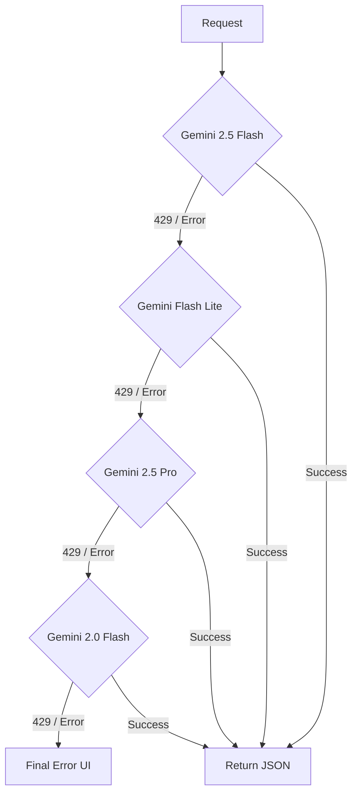

# 🧠 GK Stock Insights — Business & Technical Logic Documentation

This document provides a detailed breakdown of the internal logic, scoring algorithms, and technical architecture powering the Indian Stock Fundamental Analyser.

---

## 💎 1. Business Logic: Scoring & Ranking

The core value of the app is the **Composite Scoring Engine**, which translates raw market data and AI insights into a single 0–100 score.

### 📊 1.1 Equity Scoring Logic (Penny & Nifty 100)
Used in the "Penny Stocks" and "NIFTY 100" tabs to rank undervalued opportunities. 

**Expert Override Layer (Fix):**
To eliminate AI hallucinations, the final recommendation is now programmatically recalculated in the frontend:
1. **Derived Upside:** Calculated as `(Analyst Target - CMP) / CMP`.
2. **Valuation Safety Cap:** If `CMP > Analyst Target`, the total score is strictly capped to prevent false-positive "BUY" signals on overvalued stocks.
3. **Live Sync:** Both the screener and single-stock reports perform this recalculation on-the-fly using the latest live market data.

| Factor | Weight | Logic / Formula |
| :--- | :--- | :--- |
| **Price Momentum** | 25% | Calculated as the % change over the last 5 trading days. Higher positive momentum scores higher. |
| **Volume Surge** | 20% | Compares current volume to the 3-month average. Ratio > 3.0x gets a max score. |
| **52W High Proximity** | 15% | Percentage distance from the 52-week high. Stocks trading near highs are favored for strength. |
| **Value (P/E)** | 15% | Compares current P/E to the Sector Median P/E. Stocks below sector average score higher. |
| **RSI Sweet Spot** | 15% | Uses Wilder's RSI(14). Optimal range is 40–65. Avoids "overbought" (>70) or "dead" (<30). |
| **Stability (MCap)** | 10% | Logarithmic scale based on Market Cap. Favors established stability over micro-caps. |

### 📈 1.2 F&O Scoring Logic
Used in the "F&O Trading" tab to identify high-probability derivative plays.
**Strategy Filtering:** Traders can now filter these picks using a budget dropdown (₹50k – ₹5L) which cross-references the AI-calculated **Max Risk** for each strategy.

| Factor | Weight | Logic / Formula |
| :--- | :--- | :--- |
| **OI Size** | 20% | Large Open Interest indicates deep liquidity and institutional participation. |
| **OI Change %** | 20% | Positive change in OI (Buildup) + Price increase = Strong Bullish Signal. |
| **Price Trend** | 20% | Directional confidence over 5 days. |
| **IV Sweet Spot** | 15% | Implied Volatility between 20%–50% is ideal for directional option buying. |
| **Volume Ratio** | 15% | Ratio of current contract volume vs. average. |
| **Put-Call Ratio** | 10% | Balanced sentiment (0.7 to 1.3). Extremes suggest reversal risk. |

| **AUM & Scale** | 10% | Favors funds with large AUM (>₹20k Cr) for liquidity and stability. |
| **Dual Analysis** | Bonus | Agreement between Research Desk & AI Analyst increases confidence. |

### 📊 1.4 Crypto Discovery Logic
Used in the "Crypto Picks" tab to identify high-potential assets under ₹200.

| Factor | Weight | Logic / Formula |
| :--- | :--- | :--- |
| **Multibagger Calc** | 30% | AI-simulated forward multiple vs All-Time High (ATH) recovery potential. |
| **Utility Score** | 25% | Evaluation of real-world adoption, ecosystem growth, and protocol security. |
| **India Suitability** | 20% | Availability on WazirX/CoinDCX + Indian tax impact reconciliation. |
| **Risk Factors** | 15% | Regulatory risk, liquidity depth, and volatility profiling. |
| **Price Discipline** | 10% | Enforces a strict ₹200 cap to identify accessible opportunities for retail. |

### 🏷️ 1.3 Recommendation Tiers
The final composite score is mapped to actionable badges. Note: Recommendations are now strictly enforced by the **Valuation Safety Cap** logic.
- **80 – 100:** ⭐ **STRONG BUY** (High momentum + Undervalued)
- **60 – 79:** ✅ **BUY** (Positive trend + Reasonable valuation)
- **40 – 59:** ⚠️ **HOLD** (Sideways movement, fair valuation, or hit Analyst Target)
- **20 – 39:** 🔻 **AVOID** (Negative trend or overvaluation)
- **0 – 19:** ❌ **SELL** (Crashing volume + Extreme sell-off)

---

## 🧠 2. Business Logic: AI Strategy

### 🤖 2.1 The "Master Router" Prompting
AI calls are designed to be "Strategy-First." Instead of just fetching data, the AI acts as a filter.

**Instruction Pattern:**
- "Analyze like a SEBI-registered professional."
- "Provide a 3-leg strategy: Entry, Target, and Stop-Loss."
- "Identify exactly 3 risks per stock."
- "Classify the technical trend as UPTREND, DOWNTREND, or SIDEWAYS."

### 🔄 2.2 AI Self-Learning Pipeline (v2.0 — Supabase)
The platform implements a sophisticated Reinforcement Learning-style feedback loop powered by Supabase:
1.  **Continuous Tracking**: Every AI recommendation is logged to the `recommendations` table with a "PENDING" status.
2.  **Outcome Checkpoints**: An automated process (Outcome Tracker) verifies stock prices at 7, 14, and 30-day intervals.
3.  **Performance Feedback**: Recommendations are marked as **WIN**, **LOSS**, or **PARTIAL** based on target/stop-loss hits.
4.  **Learning Injection**: Before every new analysis, the system fetches the last 20 outcomes and injects them into the AI's prompt as "Self-Learning Feedback."
5.  **Adaptive Strategy**: The AI analyzes its past failures and adjusts its selection criteria in real-time to avoid repeating previous mistakes.
6.  **Learning Takeaways**: AI-generated insights into *why* it changed its strategy are stored in the `ai_learning_log` for user transparency.

---

## 🛠️ 3. Technical Logic: Performance & Reliability

### 🚀 3.1 Parallel Execution (`Promise.allSettled`)
To achieve sub-3-second load times for the Top 10 picks:
- **WRONG:** Sequential loops waiting for each stock's Yahoo Finance data.
- **RIGHT:** Batch processing. All 10 tickers are fired simultaneously. We use `allSettled` to ensure one failed ticker doesn't crash the entire dashboard.

### 🛡️ 3.2 AI Fallback Cascade (The "Bulletproof" Chain)
Since LLM APIs can be flaky or hit rate limits (429), we implemented a multi-level fallback in `ai-provider.ts`:

- **5-second sleep** between retries to allow rate-limit windows to reset.
- **Quota Separation:** Each model uses a different quota bucket, increasing the chance of success.
- **Hardened JSON Recovery:** `parseAIJson` automatically strips markdown fences, repairs trailing commas, and extracts the raw JSON block to prevent "Unreadable Data" errors.
- **Safety Bypass:** All AI requests use `BLOCK_NONE` safety settings to ensure comprehensive financial analysis without model-level censorship.

### 💾 3.3 Multi-Layer Caching (`gkCache`)
Implemented in `perf-utils.ts` to reduce API costs and latency:
- **Memory Cache:** Instant access for current session.
- **LocalStorage Cache:** Persists across tabs/refreshes.
- **Dynamic TTL:**
    - **Market Hours:** 60 seconds (Live prices must be fresh).
    - **After Hours:** 6 hours (Prices don't change).
    - **AI Screener:** 5 minutes (Strategic views are slower to change).

### 📡 3.4 Market-Hours Awareness
The `useMarketStatus` hook prevents unnecessary API calls:
- **Polls every 60s** only during 09:15 – 15:30 IST, Monday – Friday.
- **Auto-Pauses** if the browser tab is hidden (using `visibilitychange` API) to save user data/battery.

### 🛡️ 3.5 UI Hardening & Defensive Rendering
Implemented to handle inconsistent AI responses and edge-case market data:
- **Optional Chaining:** Ubiquitous use of `?.` for all AI-derived properties (performance, technical, thinking).
- **Fallback Formatter:** Numeric metrics use `(val ?? 0).toLocaleString()` to prevent crashes on partial data.
- **52W Context:** Every asset type (Stock, F&O, Crypto) now renders 52-week High/Low extremes for price context.
- **Explicit F&O Actions:** F&O strikes are explicitly prefixed with "BUY" or "SELL" to eliminate tactical ambiguity.
- **Truncation Fix:** Multi-leg F&O strategies use full-width row spanning and line wrapping to prevent instructions from being cut off.

---

## 📊 4. Technical Logic: My Portfolio

### 🔒 4.1 Zero-Backend Persistence
The Portfolio tab uses `localStorage` as the primary database.
- **`gk_portfolio_entries`:** Stores user-added stocks (ID, Symbol, Qty, Price).
- **`gk_portfolio_ai_cache`:** Stores the latest AI recommendations per symbol.

### 📥 4.3 Excel Data Ingestion
A high-performance bridge between local spreadsheets and the web dashboard.
1. **Dynamic Templating**: The app generates a `.xlsx` file pre-filled with the user's current holdings using `XLSX.writeFile`.
2. **Serial Date Normalization**: Implements a robust converter for Excel's 1900-date-system (serial numbers) to standard JS ISO dates.
3. **Fuzzy Header Mapping**: Recognizes diverse CSV/Excel headers like "Qty", "Quantity", and "Number of Shares" to minimize import errors.
4. **Smart Deduplication**: Cross-references incoming symbols against existing `localStorage` entries before commit.

### ⚡ 4.2 Batch AI Recommendations
Unlike the screener which gets a pre-made list, the Portfolio AI must handle **custom user lists**.
1. Collects all unique symbols from the user's portfolio.
2. Sends a single batch prompt to Gemini: "Analyze these 7 stocks and return a JSON array."
3. Maps results back to the UI table using the Symbol as the key.

---

## 📑 5. Technical Logic: PDF Export
Uses `jsPDF` and `jspdf-autotable`.
- **Logic:** Transcodes the current React state (table rows) into a PDF document.
- **Adaptive Layout:** 
    - **Table Mode:** Uses Landscape orientation to fit all metrics.
    - **Card Mode:** Uses Portrait orientation with multi-line text wrapping for AI "Reasoning" and "Risks."

---

## ⚠️ 6. Error Handling Classification
The app categorizes errors to provide better UX:
- **Rate Limit (429):** Shows a "Wait 60s" message.
- **Quota (402):** Prompts for a different API key.
- **Market Closed:** Shows a status badge and uses cached prices.
- **Network (5xx):** Triggers the fallback retry mechanism.
